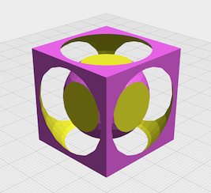
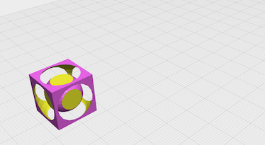

# Object transforms and V2 changes


## Current implementation

### overview

Transformations in Jscad/ Csg.js are currently **'baked in'** ie, 
- you have an object with 3 points (using 2d shapes for simplicity, and all pseudocode)
    
    ```[ [0, 0], [10, 0], [10,10]]```

- when you apply a translate([10, 0]) operation to the object above , ie something like:

    ```javascript
    const shape1 = fromPoints([ [0, 0], [10, 0], [10,10]])
    const shape2 = translate([10, 0], shape1)
    ```
    during the *translate* operation we go through each of the points of the shape, and apply the operation, so shape2's point are changed like this:

    ```[ [0 +10, 0], [10 + 10, 0], [10 + 10,10]]```

    ie

    ```[ [10, 0], [20, 0], [20,10]]```

    * other than an offset position, the structure of ***shape1*** and ***shape2*** is 100% identical: 
    ie if you move a complex shape with holes around, it is still the ***same*** shape, just somewhere else.
    The same also applies for rotations & scaling.

 - this is easy to see visually:
  
  

  has the same shape but a different ***position*** as

  

  has the same shape but a different ***rotation*** as

  


### consequences:
  #### ***CPU/computation cost***
  
  Currently any transformation (translate, rotate, scale etc) updates ***every*** point of every vertex of every polygon (essentially newVertices => oldVertices.map(transform)), this can be very costly and does not scale well 
   
   for example in the case below
   ```javascript
    const shapeA = someFunctionThatCreatesSomeComplexGeometry()
    const shapeACopySomewhereElse = translate([10, 0, 0], shapeA)
    const shapeACopySomewhereDifferent = translate([-10, 0, 0], shapeA)
   ```
   - we had the computation time needed for creating shapeA
   - we have to go through every point of every polygon of `shapeA` to create `shapeACopySomewhereElse`
   - we have to go through every point of every polygon of `shapeA` to create `shapeACopySomewhereDifferent` **again**
   
this can pile up quite fast !

  #### ***Memory cost***
  
  A similar issue also applies to memory consumption: for every transformation we need to store a copy 
  of *the entire geometry of the original shape*

  for example in the case below
  ```javascript
  const shapeA = someFunctionThatCreatesSomeGeometry()
  const shapeB = translate([10, 0, 0], shapeA)
  ```
  means
  - all the geometry of **shapeA** is and stored in memory **again** in **shapeB**

  Imagine if you have something like: 

  ```javascript
  const shapeA = someFunctionThatCreatesSomeGeometry()
  const shapeB = translate([10, 0, 0], shapeB)
  const shapeC = rotate([0, 45, 0], shapeA)
  // ah , we wanted 25 of shapes, spread out
  const lotsOfShapes = Array(25).fill(12)
    .map((x, index) => rotate([0,25, 2*index], scale([1, 0.2, 2], shapeA)) // both rotate AND scale so X2
  ```
  this means that we have 3 (shapeA, B, C) + 25 * 25 times the data of **shapeA** now stored into memory


## A possible way to solve this

 - we propose to seperate object ***TRANSFORMS*** (transformation matrix) from object ***STRUCTURE***

    * our base shapes: ```{geometry}``` would become =>```{transforms, geometry}```

      which means, when reusing our original example, 
      shape1's structure is still: 

        ```[ [0, 0], [10, 0], [10,10]]```

      but it now has a transforms property (identity matrix by default)
      
        ```[1,0,0,0, 1,0,0,0, 1...]```

     our API does *not* change, so we still do 

      ```javascript
      const shape1 = fromPoints([ [0, 0], [10, 0], [10,10]]) // => {transforms: mat4.identity(), geometry}
      const shape2 = translate([10, 0], shape1) // this  {transforms: mat4.identity() * mat4.translation([10, 0,0]), 
      ```
      unlike in V1, shape2's structure is still ***the same*** as shape1's after the transform 

      ```[ [0, 0], [10, 0], [10,10]]```

      but its ***transforms*** are different! 

      ```[.... 1, 0, 10, 0, 0, 1]```

  - This solves all of the issues of the current version:
    * As long as we are not applying operations that change the actual STRUCTURE of the shape (booleans etc) 
      we only store a **reference** to the original shape's (**shape1**) geometry, which barely has any memory cost
    * we just clone & update the transformation matrix of the original shape (**shape1***) for our new shape (**shape2**) which is trivial and fast (low memory & cpu cost)
    * we can also pass that transformation matrix along with the geometry to WebGL for display (which is also very fast & efficient)
    * if we want to export the data to various file formats we either
      * need to bake in the transforms if the format has no support for seperate transforms (STL) so no change to how we currently operate 
      * or we can keep the structure & transform data seperate , for formats like AMF/ 3MF.
    since exporting happens a lot less than displaying the shapes on screen, this is again much more efficient

  This also brings some additional perks:

  * possible use of instancing : same object with different transforms at different places
  * real time movement of the final parts in assemblies , a feature request that comes up regularly: you could place parts (once their shape is final) with close to 0 computational cost: move them with your mouse, create animations etc

        
  > note: in the current implemenation almost only the boolean /csg operation need the baked in transforms but even that can be changed very simply by applying the transforms during the boolean op


# conclusion

We are in the process of implementing these changes into the V2 codebase, and need to iron out some issues that stem from changing the structure of the basic 2D/3D data structures.
If you have feedback, see issues that we might have missed, please let us know!